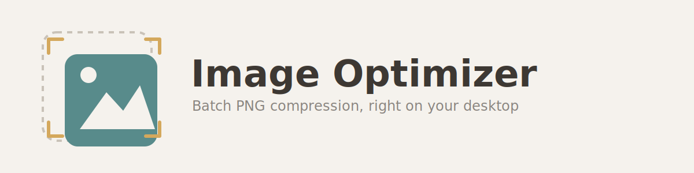

<picture>
  <source media="(prefers-color-scheme: dark)" srcset="assets/banner.png">
  
</picture>

# Image Optimizer

Batch PNG compression with a local web UI. Uses **pngquant** (lossy quantization) and **oxipng** (lossless strip/optimization) behind a clean interface.

## Features

- **Local folder scanning** — select a directory, scan recursively (optional), and pick which files to optimize
- **Before/after preview** — overlay and side-by-side compare views
- **Three compression modes:**
  - `standard` — pngquant + oxipng, best size reduction
  - `lossless` — oxipng only, no color loss
  - `resize only` — scale down, no quantization
- **Output format** — PNG (via pngquant/oxipng) or WebP (via Pillow's built-in encoder, no extra binary needed)
- **Color protection** — list hex colors to preserve in the palette
- **Dithering toggle** — smoother gradients (standard mode)
- **Output directory** — save results to any folder (or use the built-in ZIP download)
- **Recent folder history** — quick-access chips with per-item removal and clear all
- **Auto-detect binaries** — finds `pngquant`/`oxipng` in `bin/` folder or system PATH
- **Cross-platform** — Windows, macOS, Linux (pre-built exe for Windows; macOS/Linux users need `pngquant`/`oxipng` on PATH)

## Quick Start

### Option 1: Standalone EXE (Windows, no Python required)

Download the latest release from the [Releases page](https://github.com/aREversez/image-optimizer/releases) and run `ImageOptimizer.exe`.

> **Windows SmartScreen:** The exe is unsigned (code signing certificates cost $200+/year for open-source projects). On first run, SmartScreen may show "Windows protected your PC" — click **More info** → **Run anyway**. This is normal for unsigned open-source software.

### Option 2: From source

```bash
git clone https://github.com/aREversez/image-optimizer.git
cd image-optimizer
pip install -r requirements.txt
python -m app          # or: start.bat
```

Open http://127.0.0.1:8090 in your browser.

The first run will auto-detect `pngquant` and `oxipng` in the `bin/` folder and system PATH. See `bin/README.md` if a binary is missing.

## Usage

1. **Enter a folder path** — type or browse to select a directory, then click *Scan Folder*
2. **Review files** — deselect any you want to skip, adjust quality/width/mode
3. **Protect colors** (optional) — add hex colors like `#2ecc71` to preserve
4. **Start** — click *Start* and watch the live progress log
5. **Compare & download** — click any result's *Compare* button for before/after preview, then download individual files or the full ZIP

## Configuration

Command-line flags:

```
python -m app --host 127.0.0.1 --port 8090 --workers 4 --dir "D:\screenshots"
```

- `--host` — listen address (default `127.0.0.1`, see Security below)
- `--port` — listen port (default `8090`; if taken, the next free port is used automatically)
- `--workers` — how many images to process/thumbnail concurrently (default `4`).
  Lower this if pngquant/oxipng are already maxing out your CPU; raise it on a
  many-core machine for faster batches.
- `--dir` — auto-scan this folder on startup

For settings you don't want to type every time, create a `config.json` in
`~/.image-optimizer/` (that's `%USERPROFILE%\.image-optimizer\config.json`
on Windows, or `~/.image-optimizer/config.json` on macOS/Linux — the same
folder on every OS, and the same one `recent.json` already lives in). This
file isn't created automatically and there's no in-app settings screen yet
— copy [`config.example.json`](config.example.json) there and edit it, or
start from scratch with:

```json
{
  "host": "127.0.0.1",
  "port": 8090,
  "concurrent_workers": 4,
  "workspace_cleanup_delay": 10.0,
  "session_idle_timeout_hours": 4
}
```

Other flags:

- `workspace_cleanup_delay` — seconds to wait before deleting a workspace after
  it's replaced by a new scan/upload (default `10.0`). Files aren't deleted
  immediately so an in-flight request — e.g. a ZIP download or an image still
  loading in another tab — has time to finish before they disappear out from
  under it. Raise this if you routinely have slow downloads running when you
  start a new scan; lower it to free disk space sooner.
- `session_idle_timeout_hours` — how long a browser session (and its scan
  results, in-progress state, and temp workspace) is kept after you stop
  using it before being cleaned up automatically (default `4`). Each browser
  tab/session is tracked separately so multiple tabs don't interfere with
  each other; this controls how long an abandoned one hangs around before
  its temp files are freed. Also sets how long the session cookie itself is
  valid for.

All keys are optional — only include the ones you want to change from the
default (an empty `{}` or a missing file both just mean "use every
default"). Command-line flags always override `config.json`, which
overrides the built-in defaults. Invalid values (e.g. a negative worker
count) are ignored with a startup warning rather than crashing.

## Security

This app has no authentication and is meant to run on `127.0.0.1` only (the
default). It can read any directory you point it at and write to any path
you specify as the output folder — fine for local, single-user use, but
**don't** start it with `--host 0.0.0.0` or a LAN address unless you fully
trust everyone on that network, since there's nothing stopping them from
reading or writing files on your machine through it.

## Requirements

- **Source install:** Python 3.10+ with `fastapi`, `uvicorn`, `Pillow`, `jinja2`, `python-multipart`
  (`pip install -r requirements.txt`, or `pip install -r requirements.lock` for the exact
  versions this was tested against)
- **Standalone EXE:** Windows 10/11 64-bit, no Python required

## Project Structure

```
image-optimizer/
├── app/              # Python web application
│   ├── main.py       # FastAPI server & routes
│   ├── optimizer.py  # pngquant/oxipng orchestration
│   ├── models.py     # Pydantic request models
│   └── templates/    # HTML/CSS/JS frontend
├── assets/           # Logo, icons, banner images
├── bin/              # Binary dependencies (pngquant, oxipng)
├── images/           # Default scan directory (gitignored)
├── build_exe.py      # PyInstaller build script
├── pyproject.toml    # pip-installable package config
├── requirements.txt
└── start.bat
```

## License

MIT
